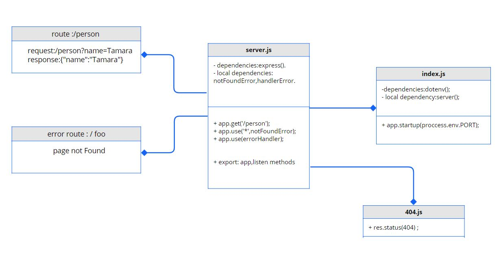

# Basic-express-server

### Author: Tamara Alrashed

### [Submission PR]()
### [Tests report]()
### [Deployment]()

## Setup
`.env`  requirements 
`PORT` - Port Number  

## Running the app  
`npm start`  

## Tests
Unit Tests: `npm run test`

## UML

